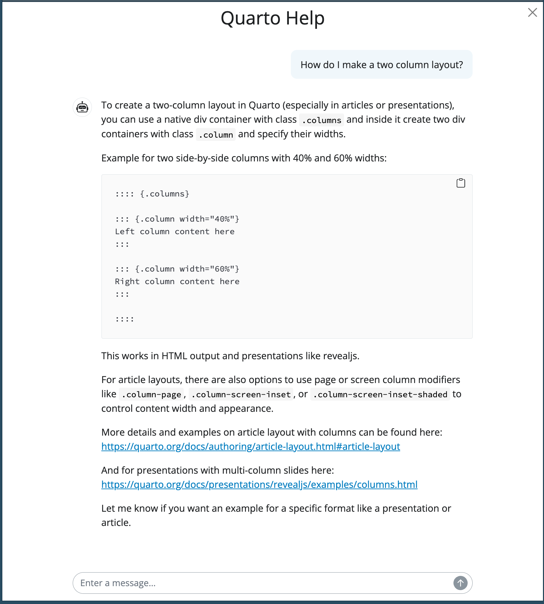

# tmhelp

<!-- badges: start -->

<!-- badges: end -->

A focused chat app for quick, authoritative answers from tidymodels
documentation. Based on 
[`t-kalinowski/quartohelp`](https://github.com/t-kalinowski/quartohelp).

`tmhelp` launches an interactive chat interface that finds and
summarizes relevant excerpts from tidymodels documentation using both
semantic and keyword-based search methods (via
[ragnar](https://github.com/tidyverse/ragnar)). Chat responses include
links to official sources and are designed to help users quickly
accomplish specific tidymodels tasks.

## Screenshot

<!--  -->

## Usage

``` r
# Launch with a blank chat
tmhelp::ask()

# Start with a specific question
tmhelp::ask("How do I tune a regularized logistic regression model?")
```

## Installation

``` r
remotes::install_github("topepo/tmhelp")
```

## Requirements

-   An OpenAI API key must be set in `Sys.getenv("OPENAI_API_KEY")`.
-   A typical question costs approximately 1 to 2 cents with the current
    flagship `gpt-4.1` model.
